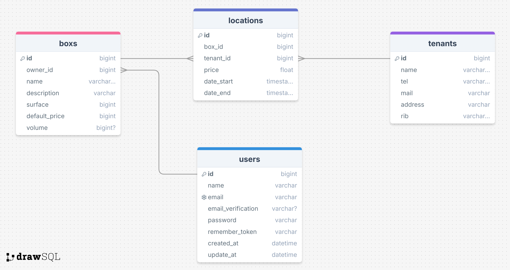

# BoxMaster

## Table des matières

- [BoxMaster](#boxmaster)
  - [Table des matières](#table-des-matières)
  - [Présentation](#présentation)
  - [MCD](#mcd)
  - [Fonctionnalités](#fonctionnalités)
  - [Prérequis](#prérequis)
  - [Installation](#installation)
  - [Commande utiles](#commande-utiles)
  - [Contributeurs](#contributeurs)
- [Demander à Kévin](#demander-à-kévin)
## Présentation

Ce projet consiste à développer une application de gestion de locations de box de stockage pour les propriétaires, permettant la gestion des box, des locataires, des contrats, des paiements, des impôts et des factures. L'application doit inclure des fonctionnalités d'authentification, de gestion de modèles de contrats, de suivi des paiements et des impôts, ainsi que des exports de données et des envois de factures automatiques. Le projet doit être développé en utilisant Git et GitHub, avec des issues, des milestones et des branches. Les livrables finaux incluent le code source, un script de déploiement automatique et un URL d'accès au projet.

* Prod [C'est ici ?](http://kevin.voisine.angers.mds-project.fr/)

- User 1
* 'email' => user.one@test.prod
* 'password' => password

- User 2
* 'email' => user.two@test.prod
* 'password' => password


## MCD



## Fonctionnalités

* En attente d'informations

## Prérequis

* **PHP** : version 8.2 ou supérieure
* **Composer** : version 2.0 ou supérieure
* **Node.js** : version 22 ou supérieure
* **SGBD** : Sqlite

## Installation

Pour installer le projet, executez ceci :

```shell
git clone git@github.com:Frize01/TP-BoxMaster.git
cd BoxMaster
composer install
npm install
cp  .env.example .env
php artisan key:generate
php artisan migrate
php artisan db:seed
npm run dev
```
Sur un autre Terminal :

```shell
php artisan serve
```

## Commande utiles

- PHPCS : ```vendor/bin/phpcs -v app```
- PHPStan : ```vendor/bin/phpstan analyse -c phpstan.neon```

## Contributeurs

* Y'a que moi


# Demander à Kévin

* Explication des tests unitaires